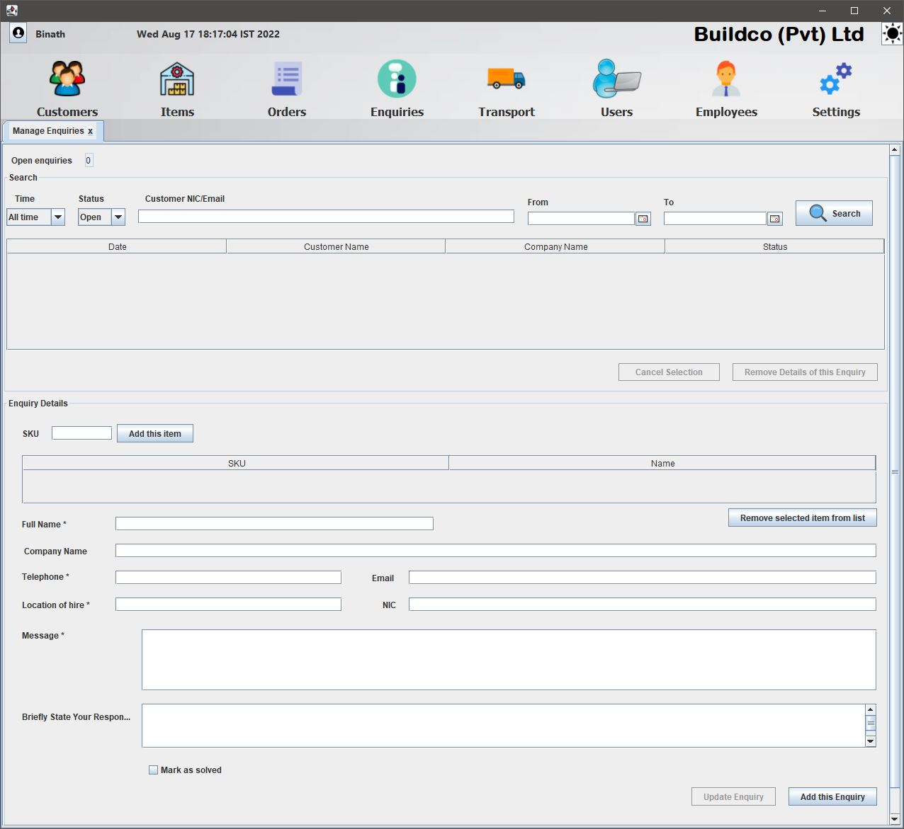

# Plant-Hire-Management-ERP

This was a system built to improve the productivity of a plant hire management company. This was done by introducing a java based 
software application which enhanced the speed of operations as opposed to using a manual bookeeping system.
* Language: Java SE. No frameworks or ORM tools were used. Pure Java with JDBC. 
* Database: MongoDB (Since a NoSQL database was used, entities were denormalized appropriately to strike a balance between data redundancy and performance)
* Image Storage: MongoDB Grid FS 
* Reporting: Jasper
* Design patterns used: DAO Factory, Singleton

# Business Process

# Features

## For Service staff

### Customer management module
    • Get details of all customers as well as filter the search by customer email / NIC.
    • Update customer’s personal and web account (username, password) details
    • Remove any information related to a customer.

### Enquiry management module
    • Add new enquiries along with the enquired item SKUs
    • See the count of open enquiries
    • View all enquiries
    • Search filter to get enquiries placed within a given date period.
    • Search filter to get the open enquires.
    • Search filter to get the closed enquires.
    • Multiple filters should work together.
    • Open or close an enquiry.
    • Change  enquiry details

### Order management module
    • Existing orders
        ◦ Search filter to get order by order ID
        ◦ Search filter to get orders placed within a provided date range
        ◦ Search filter to get orders items requested within a provided date range.
        ◦ Search filter to get open or closed orders
        ◦ Ability to not apply any filter and get all orders.
        ◦ Filters should work together.
        ◦ View, remove and upload lease agreement file to and from the database.
        ◦ View all order details including installment details
        ◦ Ability to generate invoice and receipt after selecting the installment
        ◦ Have the options to print or auto email the invoice or receipt to the customer
        ◦ Option to mark the order as closed
        ◦ Confirmation before addition, removal and updating of order details.

    • Place an order
        ◦ Ability to search if a customer is already registered using NIC or email.
        ◦ Ability to add a new customer.
        ◦ Search for item availability, add and remove items from the order.
        ◦ Add or remove installment details linked to a date.
        ◦ Upload, view and remove lease agreement file to and from the database.
        ◦ Set if delivery services are required.
        ◦ Confirmation before addition, removal and updating of order details.

    • Ability to easily receive notifications on any invoices to send based on selected date on button click.
    • Ability to easily receive notifications of any overdue payments on button click. 

In addition to the above-mentioned modules service staff managers requests certain features requested by the human resource department for employee management. 

## For Depot Staff

### Item management module
    • Ability to upload an item image, user manual, and service manual to the database.
    • Ability to add the item.
    • Ability to search item by SKU or name.
    • Ability to search item without any filters.
    • Update all item details except SKU.
    • View all item details including total quantity and available quantity after selection of a search item.
    • Ability to remove the item.

### Transport management module
    • See an overview of all the orders that have been requested for delivery/pickup based on a provided date range.
    • See all the items requested by an order when a search result is selected.
    • Add details regarding the IDs of assigned staff members and any additional details regarding the transportation of items.
    • Update if items have been delivered or received.
In addition to the above-mentioned modules depot staff managers requests limited features in the employee management module (Provided under human resource requirements). 

## For Human resource staff

### Employee management module
    • Add new employee
    • Automatically calculate hourly rate of an employee when work week and hours per day are entered.
    • Upload, view and remove qualifications document for employee.
    • Upload, view and remove employee agreement for employee.
    • Update employee details.
    • Upload current job details.
    • Upload clock in , clock out and other work details for the day.
    • Search for employees by ID or view all employees.
    • Search for employee work history by date.
    • Remove employee details.
	
### User management module
    • Create new user.
    • Add or remove privileges from the user.
    • Update user details including username and password.
    • Search for all users or filter a user by employee ID.
    • Remove user.

## For company manager

### Daily overview
    • View details such as total employees, employees clocked in, net asset value and liabilities.
    • Add and removed goals.

### Report generation module
    • Ability to generate reports by year.
    • Sales revenue report
    • Expenses report 
    • Asset valuation report
In addition to the above-mentioned modules owner requires the ability to turn on any of the modules given under customer service, depot and human resource management areas. Also managers in any department have access to limited features in modules that fall under the other departments based on the role he performs in the organization.

## General features for all staff users

    • Log in
    • Forgot password option (Temporary password valid for 10 min)
    • Sign out
    • Restart application
    • Option to turn on or off 2-Factor Authentication (Pass code valid for 10 min)
    • Ability to change the password
    • Light and dark modes

# Development

**This repository contains the native java application used by employees. The web application was developed as a seperate project.

## Application

**Design patterns used include Singleton and DAO Factory**

## Database ERD

# Interfaces

## Dashboard

## Customers module

## Items module

## Orders module

## Enquiries module

## Transport module

## Users module

## Employee module

## Report module

## Settings module

